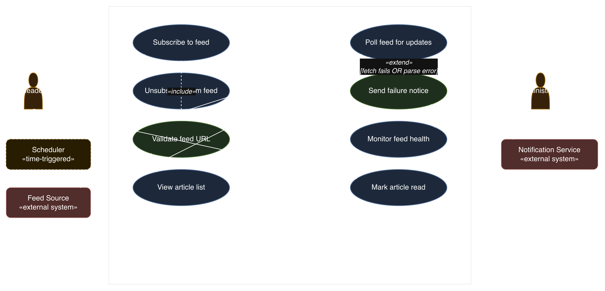

# RSS Feed Reader — Use Case Analysis

## 1. Problem statement

People who follow many websites — news sites, blogs, podcasts — have no easy way to know when any of them publish something new. Checking each site by hand takes time and articles get missed. An RSS feed reader solves this by letting a person subscribe to the sites they care about once, then automatically checking those sites in the background and showing all new articles in one place.

A reader signs up, adds feed subscriptions by pasting in a website's feed URL, and from then on sees a single, always-current list of new articles pulled from every site they follow. They can mark articles as read, search past articles, and unsubscribe from feeds that are no longer useful. Behind the scenes, the system checks every subscribed feed on a regular schedule, without the reader having to ask. If a feed becomes unreachable or starts returning malformed data, the system flags it so an administrator can investigate rather than letting the reader silently miss updates from that source.

An administrator is responsible for keeping the overall system healthy: they can see which feeds are failing to update, manage reader accounts, and remove feeds that are permanently broken or abusive. The system also depends on two things outside its own walls: the websites themselves, which publish the actual XML/JSON feed files the system reads, and a notification channel (email/push) used to alert people when something goes wrong.

The goal of the system is simple: readers should never have to visit a website just to check "is there anything new," and administrators should always know the health of every subscribed feed without manually testing each one.

## 2. Actors

| Actor | Type | Description |
|---|---|---|
| Reader | Primary human actor | Subscribes to feeds, reads articles, marks them read/unread, searches, unsubscribes |
| Administrator | Human actor | Manages reader accounts, monitors feed health, removes broken/abusive feeds |
| Scheduler | Time-triggered system actor | Fires automatically on a fixed interval (e.g. every 15 minutes) to initiate polling of every subscribed feed — no human starts this use case |
| Feed source (website) | External system | The publisher's server; hosts the XML/JSON feed file the system fetches over HTTP |
| Notification service | External system | Delivers email or push alerts when a feed fails or when other system events occur |

## 3. Use case diagram

See the diagram rendered in the conversation above the document. It shows the system boundary ("RSS feed reader system") containing eight use cases:

1. Subscribe to feed
2. Unsubscribe from feed
3. Validate feed URL
4. Poll feed for updates
5. Send failure notice
6. View article list
7. Mark article read
8. Monitor feed health

**Include relationship:** `Subscribe to feed` «include» `Validate feed URL` — every subscription attempt must validate the URL is a reachable, parseable feed before it's saved; this step is never optional.

**Extend relationship:** `Poll feed for updates` «extend» `Send failure notice`, guard condition `[fetch fails OR parse error]` — a failure notice is only generated when polling actually fails; on a normal successful poll this use case never fires.

**Actor associations:**
- Reader → Subscribe to feed, Unsubscribe from feed, View article list, Mark article read
- Scheduler → Poll feed for updates
- Administrator → Monitor feed health
- Notification service → Send failure notice (receives the outbound notification request)
- Feed source is invoked internally during Validate feed URL and Poll feed for updates (not shown with a direct association line to keep the diagram readable — mention this explicitly in your write-up if your instructor wants every external system drawn with a line)

## 4. Full use case specifications

## Notes for write-up / submission

- If your rubric wants every external system actor drawn with an explicit association line (rather than described in prose, as done above for Feed source), add two lines from `Feed source` to `Validate feed URL` and `Poll feed for updates` on the diagram.
- The include relationship is mandatory-and-always-run (Validate feed URL runs on *every* subscribe attempt); the extend relationship is conditional (Send failure notice only runs *when the guard is true*) — that's the graded distinction to call out explicitly if asked to justify the choice.
- Feel free to swap "Search articles" or "Unsubscribe from feed" in as a fourth full spec if your team wants more coverage; the diagram already includes both as valid targets.

20251501170
20251501137
20251501139
20251501143
20251501161